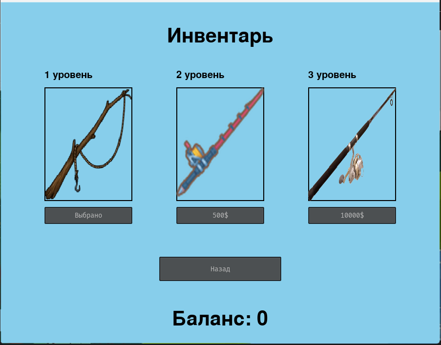

# Пояснительная записка

## Краткое описание

"Симулятор рыбалки" - простенькая игра, написанная на pygame. Как таковой цели в игре нет, ее задача -

### Стартовое окно

Первое, что встречает пользователя при запуске игры - стартовое окно, где пользователь может либо начать игру (кнопка
старт), либо
выбрать себе удочку (по кнопке инвентарь), либо настроить громкость музыки (по кнопке настройки)

### Настройки

Щадесь пользователь может настроить громкость великолепной музыки с помощью ползунка.

### Окно инвентаря

Здесь игрок может либо купить удочку, либо же выбрать удочку себе по душе ищ уже купленных.
Всего есть 3 уровня удочки. От уровня удочки зависит скорость вылавливания рыбы и стоимость пойманной рыбы.

### Окно игры

Это основная часть игры. В чем заключается суть? Игрок должен навестить поплавком на рыбку и нажать на нее, в случае,
если игрок попал по рыбке, то она начнет вытягиваться. И ее стоимость добавится в улов. У игрока есть 60 секунд на одну
рыболовную сессию. По истечении 60 секунд или при вылавливании всей рыбы игра завершается и начинается подвод итогов
рыбалки.

### Окно итогов

Здесь вы узнаете сколько дже вы заработали, продав всю пойманную рыбу.

### Окно результатов

Последнее окно - окно результатов. В нем демонстрируются лучшие результаты пользователей по темам. В правом верхнем углу
видны ваши ошибки при прохождении теста, если они есть

## Установка

Чтобы запустить приложение, необходимо скачать необходимые библиотеки и запустить файл _*main.py*_

## Используемые технологии

Игра написана с помощью библиотек pygame и pygame_gui.

### Сторонние файлы
* data - папка, содержащая все изображения для проекта
* money.txt - файл, в котором хранится информация о балансе игрока
* rods.txt - файл, содержащий информацию о купленных игроком удочках
* requirements.txt - файл, содержащий библиотеки, необходимые для запуска игры
